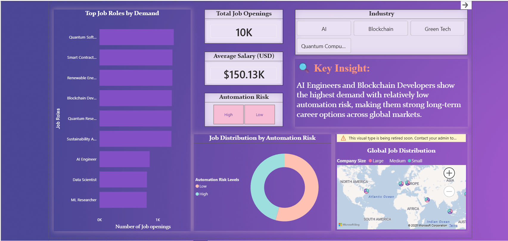

# Future Job Roles Analysis – Power BI Dashboard

## 📌 Project Overview
This project presents an analytical study of future job market trends using a Power BI dashboard.  
The dashboard highlights job demand, required skills, salary trends, and career insights to help understand how the job market is evolving across different roles and industries.

The analysis is designed to support data-driven career planning and workforce insights.

---

## 📊 Dashboard Pages
- **Job Market Overview** – High-level view of job demand and trends  
- **Skills Analysis** – Key skills required across roles and their relevance  
- **Career Insights** – Role-based insights to support informed career decisions  

---

## 🛠 Tools & Technologies Used
- **Power BI** – Data modeling, DAX measures, and dashboard creation  
- **Excel / CSV** – Dataset handling and preprocessing  
- **Data Cleaning & Data Modeling** – Preparing data for accurate analysis  

---

## 📸 Dashboard Preview

### Job Market Overview

### Skills Analysis

### Career Insights

---

## 📁 Project Files
- `Future Jobs Roles Analysis.pbix` – Power BI report file  
- `screenshots/` – Dashboard page previews  
- `README.md` – Project documentation  

---

## 🎯 Key Takeaways
- Identifies emerging job roles and market demand  
- Highlights in-demand skills across industries  
- Provides insights to support career and skill-building decisions  

---

## 👤 Author
**Rudra Pratap**  
Aspiring Data Analyst  
Skills: Python, SQL, Power BI, Excel  

